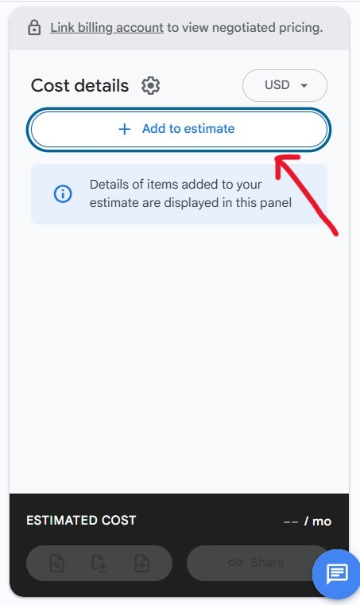
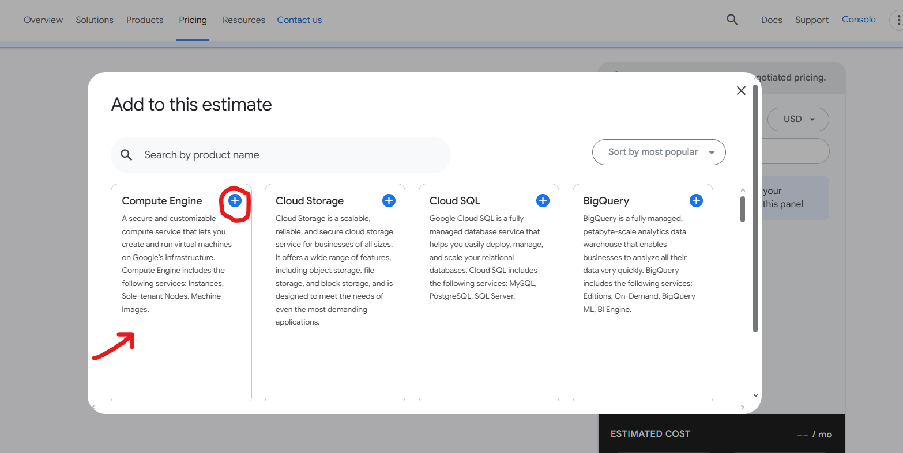
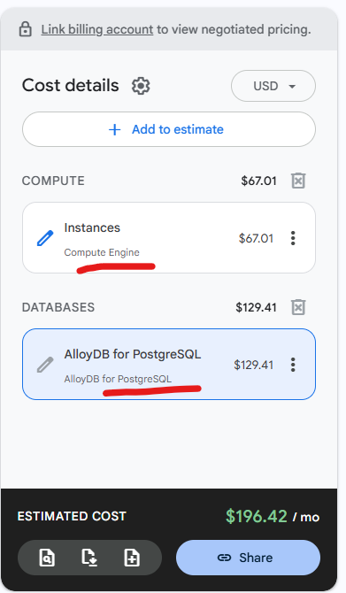

# Price Comparison for a Service Across Different Regions.

## Steps taken and lessons learned.

### First Signup or **Login** to a cloud service provider. In my case, I already use Google Cloud Platform for other projects. Hence, I was logged in automatically. 

### Next, select your **preferred service(s)**. In my case, I selected the **Compute Engine** and **AlloyDB for PostgreSQL** for the Database. 

## Price Comparison

| Region | Iowa(us-central1) | South_Carolina(us-east1) | Berlin(europe-west10) | TelAviv(me-west1) |
|----  | --- | --- | --- | --- |
**Price**  | $184.66  | $199.97  | $248.22  | $196.42  |

### Iowa(us-central1)

.png)

### South_Carolina(us-east1)

.png)

### Berlin(europe-west10)

.png)

### TelAviv(me-west1)

.png)

## Lessons Learned

A **region** is a specific geographic location for hosting resources. Each region operates independently and consists of three or more zones, which are isolated data centres with independent power and cooling, to ensure high availability.

For the names as seen above {Iowa(us-central1), South_Carolina(us-east1), Berlin(europe-west10), TelAviv(me-west1)} are all **naming conventions**. It generally follows the format: geography-direction-number

**Meaning of the Selected Regions**

- **us-central1 (Iowa)**: This region is located in Council Bluffs, Iowa, USA.
- **us-east1 (South Carolina)**: This is one of Google's long-established regions in the Eastern United States.
- **europe-west10 (Berlin)**: This is a newer region situated in Berlin, Germany, serving Western Europe.
- **me-west1 (Tel Aviv)**: This is a region in the Middle East located in Tel Aviv-Yafo, Israel.

**Why Prices Differ by Region**

Pricing is not uniform globally; a Virtual Machine (VM) that costs $0.05 per hour in one location may be more expensive in another. There are several local factors that contribute to this variation:

- **Infrastructure Costs**: The expenses associated with building and maintaining physical data centres vary by country, including costs for land, construction, and local taxes.
- **Energy Prices**: Data centres require significant amounts of electricity for servers and cooling systems. Electricity rates in regions like Berlin or Tel Aviv may be substantially higher than those in South Carolina.
- **Supply and Demand**: When demand for resources is high in a specific area, prices tend to increase. Conversely, less-utilised regions may offer more competitive rates to attract customers.
- **Local Labour and Regulations**: Differences in local labour laws, wages for technical staff, and compliance with regional data sovereignty regulations (such as GDPR in Europe) also influence operational costs.

**Important Tips for Choosing a Region**

When selecting a region, it's essential to balance cost against latency. While us-east1 might be cheaper, choosing a region closer to your actual users (for example, europe-west10 for users in Germany) will provide them with a much faster experience. You can use the Google Cloud Pricing Calculator to compare these differences in detail.
